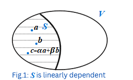
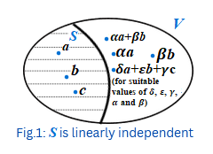
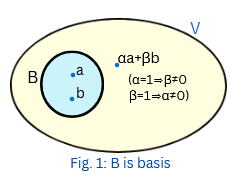
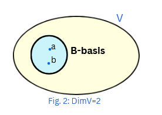
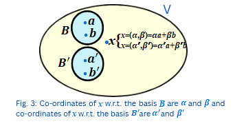

This experiment will help students understand the key ideas in linear algebra, namely linear independence, basis, dimension, and coordinates. These concepts are essential while working with vector spaces. Students will learn how to determine whether vectors are linearly independent, how a basis can be formed and how to express any vector in terms of a chosen basis to determine co-ordinates. 
<b>Notation:</b> Vector space over the field <i>F</i>≡<i>R</i> or <i>C</i>  is denoted by <i>V</i>, where <i>R</i> is the set of real numbers and <i>C</i> is the set of complex numbers. 
### 1. Linearly independence:
#### 1.1. Linearly dependent set:
Let <i>&straightphi;</i>≠<i>S</i>⊆<i>V</i>. If <i>x</i>&isin;<i>S</i> be such that <i>x</i> is a linear combination of some other elements of <i>S</i>, then <i>S</i> is said to be linearly dependent. In other words, if <i>S</i>(as given in Fig.1) is linearly dependent, then for some <i>x</i>&isin;<i>S</i>, there exists <i>y</i>1, <i>y</i>2, …,<i>y</i><i>n</i>&isin;<i>S</i>, which are different from <i>x</i> such that <i>x</i>=<i>α</i>1<i>y</i>1+<i>α</i>2<i>y</i>2+ …+<i>α</i><i>n</i><i>y</i><i>n</i>, for some <i>α</i>1, <i>α</i>2, ..., <i>α</i><i>n</i>&isin;<i>F</i>. Notice that in this case, (-1)<i>x</i>+<i>α</i>1<i>y</i>1+<i>α</i>2<i>y</i>2+ …+ <i>α</i><i>n</i><i>y</i><i>n</i>=0, i.e. there exists a linear combination of elements of <i>S</i> which equals zero, but not all coefficients are zero. Any set containing zero vector is linearly dependent.

 
#### 1.2. Linearly independent set:
Let &straightphi;≠<i>S</i>⊆<i>V</i>. Then <i>S</i> (as given in Fig.2) is said to be a linearly independent set if it is not linearly dependent. Notice that the empty set &straightphi; is defined to be linearly independent. 
Now to show that <i>S</i>={<i>a</i>, <i>b</i>}⊆<i>V</i> is linearly independent, one needs to show that <i>b</i>≠<i>αa</i> and <i>a</i>≠<i>βb</i>, for any scalars <i>α</i> and <i>β</i>.
Similarly, to show that <i>S</i>={<i>a, b, c</i>}⊆<i>V</i> is linearly independent one needs to show that none of <i>a</i>, <i>b</i> and <i>c</i> is a linear combination of the other two elements.
General method to show linear independence is provided in the proposition given below. 

#### 1.3. Proposition:
Let &straightphi;≠<i>S</i>⊆<i>V</i>. Then <i>S</i> is linearly independent if and only if [<i>α</i>1<i>x</i>1+ <i>α</i>2<i>x</i>2+ …+<i>α</i><i>n</i><i>x</i><i>n</i>=0 &#8658; <i>α</i><i>i</i>=0, for all <i>i</i>=1, 2, …, <i>n</i>; where <i>α</i>1, <i>α</i>2, ..., <i>α</i><i>n</i>&isin;<i>F</i>, <i>x</i>1, <i>x</i>2, …, <i>x</i><i>n</i>&isin;<i>S</i>].
#### Proof: Sufficient part:
Let <i>α</i><i>i</i>=0, for all <i>i</i>=1, 2, …,<i>n</i>;
whenever <i>α</i>1<i>x</i>1+ <i>α</i>2<i>x</i>2+ …+<i>α</i><i>n</i><i>x</i><i>n</i>=0, where <i>α</i>1, <i>α</i>2, ..., <i>α</i><i>n</i>&isin;<i>F</i>, <i>x</i>1, <i>x</i>2, …, <i>x</i><i>n</i>&isin;<i>S</i>. To the contrary, let <i>S</i> be linearly dependent. By definition of a linearly dependent set, there exists <i>x</i>&isin;<i>S</i>, such that <i>x</i>=<i>α</i>1<i>y</i>1+ <i>α</i>2<i>y</i>2+ …+ <i>α</i><i>n</i><i>y</i><i>n</i>, for some <i>α</i>1, <i>α</i>2, ..., <i>α</i><i>n</i>&isin;<i>F</i>, <i>y</i>1, <i>y</i>2, …, <i>y</i><i>n</i>&isin;<i>S</i>. Thus (-1)x+<i>α</i>1<i>y</i>1+<i>α</i>2<i>y</i>2+ …+ <i>α</i><i>n</i><i>y</i><i>n</i>=0. By hypothesis, -1=0. This is a contradiction.  
<b>Necessary part:</b>
Let <i>S</i> be linearly independent. To the contrary, let <i>α</i>1<i>x</i>1+ <i>α</i>2<i>x</i>2+ …+ <i>α</i><i>n</i><i>x</i><i>n</i>=0 and <i>α</i><i>i</i>≠0, for some <i>i</i>=1, 2, …, <i>n</i>. Clearly -<i>α</i><i>i</i><i>x</i><i>i</i>=<i>α</i>1<i>x</i>1+ <i>α</i>2<i>x</i>2+ …+
<i>α</i><i>i</i>-1<i>x</i><i>i</i>-1+<i>α</i><i>i</i>+1<i>x</i><i>i</i>+1+…+ <i>α</i><i>n</i><i>x</i><i>n</i>. Hence <i>x</i> <i>i</i>=-<i>α</i><i>i</i>-1(<i>α</i>1<i>x</i>1+<i>α</i>2<i>x</i>2+ …+ <i>α</i><i>i</i>-1<i>x</i><i>i</i>-1+<i>α</i><i>i</i>+1<i>x</i><i>i</i>+1+…+ <i>α</i><i>n</i><i>x</i><i>n</i>). Note that <i>α</i><i>i</i>-1 exists because <i>α</i><i>i</i>≠0. Hence <i>S</i> is linearly dependent, a contradiction.  
<b>1.4. Examples-I:</b>
Consider <i>R</i>2 be the vector space over <i>R</i>, where <i>S</i>⊆<i>R</i>2.  
(i) <i>S</i>={(0, 1), (1, 2), (2, 7)} is linearly dependent.  
Justification: Clearly, (2, 7) is a linear combination of (0, 1), (1, 2) as given below:
(2, 7)=2(1, 2)+3(0, 1). Thus, <i>S</i> is linearly dependent. Notice that 2(1, 2)-3(0, 1)+1(2, 7)=0, i.e. a linear combination of elements of <i>S</i> is zero, but all the coefficients are not zero. 
<b>Remark.</b> <i>a</i>(0, 1)+<i>b</i>(1, 2)+<i>c</i>(2, 7)=0 ⇒ (<i>b</i>+2<i>c</i>,<i>a</i>+2<i>b</i>+7<i>c</i>)=0 implies that <i>b</i>+2<i>c</i>=0 and <i>a</i>+2<i>b</i>+7<i>c</i>=0 which does not imply that <i>a</i>=<i>b</i>=<i>c</i>=0. Hence it does not determine whether <i>S</i> is linearly dependent or independent. It only gives a clue.  
(ii) <i>S</i>={(1, 2),(1, 0)} is linearly independent.  
Justification: <i>a</i>(1, 2)+<i>b</i>(1, 0)=(0, 0) ⇒ (<i>a</i>, 2<i>b</i>)+(<i>b</i>, 0)=(0, 0) ⇒ (<i>a</i>+<i>b</i>, 2<i>b</i>)=(0, 0). Thus <i>a</i>=0, <i>b</i>=0. Hence, both the coefficients are zero therefore, <i>S</i> is linearly independent.

#### 1.5. Examples-II:
(i) Consider the vector space <i>R</i>3 over <i>R</i>. Then <i>S</i>={(1, 0, 0), (0, 1, 0), (0, 0, 1)} is linearly independent.
Justification: Let <i>α</i>(1, 0, 0)+<i>β</i>(0, 1, 0)+<i>γ</i>(0, 0, 1)=0; for <i>α, β, γ</i>&isin;<i>R</i>. By solving this we get <i>α</i>=0, <i>β</i>=0, <i>γ</i>=0 which implies by definition, that <i>S</i> is linearly independent. 
(ii.) Consider the vector space <i>P</i>2(<i>x</i>) over <i>R</i>. Then <i>S</i>={1, <i>x</i>, <i>x</i>2+1} is linearly independent.
Justification: Let <i>α</i>(1)+<i>β</i>(<i>x</i>)+<i>γ</i>(<i>x</i>2+1)=0; for <i>α, β, γ</i>&isin;<i>R</i>. By solving this we get <i>α</i>=0, <i>β</i>=0, <i>γ</i>=0 which implies by definition, that <i>S</i> is linearly independent.

#### 1.6. Properties of linearly independent andb linearly dependent sets:
(i) Any set containing the zero vector is linearly dependent. In particular, {0} is linearly dependent.  
(ii) Singleton set containing a non-zero vector is linearly independent.  
(iii) Subset of a linearly independent is linearly independent. 
(iv) Superset of a linearly dependent set is linearly dependent. 

### 2. Basis:
A non-empty subset <i>B</i> (as given in Fig.3) of <i>V</i> is said to be a basis if <i>B</i> is a linearly independent set and spans <i>V</i>.

 
#### 2.1. Examples:
1. Let <i>S</i> be the linearly independent set as given in Example 5 (i). It can be seen that <i>S</i> spans <i>R</i>3. Hence <i>S</i> is a basis for <i>R</i>3. 
2. Let <i>S</i> be the linearly independent set as given in Example 5 (ii). It can be seen that <i>S</i> spans <i>P</i>2(<i>x</i>). Hence <i>S</i> is a basis for <i>P</i>2(<i>x</i>).  
### 3. Dimension:
Let <i>V</i> have a basis consisting of finitely many elements. Then the number of elements in the basis of <i>V</i> is called the dimension of the vector space <i>V</i> and is denoted by Dim. The dimension of {0} is defined to be zero as it is defined to be generated by &straightphi;.  

 
#### 3.1. Examples:
1. In Example 5 (i) the Dim of <i>S</i> is 3. 
2. In Example 5 (ii) the Dim of <i>S</i> is 3.  
#### 3.2. Properties of basis and dimension:
1. Let <i>V</i> have a finite basis. Then every basis for <i>V</i> contains the same number of vectors. 
2. If a basis of <i>V</i> has <i>n</i> elements, then any subset of <i>V</i> having <i>n</i>-1 elements does not span <i>V</i>. 
3. If a basis has <i>n</i> elements, then any subset of <i>V</i> having <i>n</i>+1 elements is linearly dependent. 
4. Let <i>B</i> be a subset of <i>V</i>. Then the following are equivalent. 
&emsp; a. <i>B</i> is basis. 
&emsp; b. <i>B</i> is a minimal generating set, that is no proper subset of <i>B</i> can generate <i>V</i>. 
&emsp; c. <i>B</i> is a maximal linearly independent set. 
<b>4. Co-ordinates:</b>
Let <i>V</i> be a vector space and <i>x</i>&isin;<i>V</i> and let <i>B</i>={<i>e</i>1, <i>e</i>2} be a basis. Then <i>x</i>=<i>αe</i>1+<i>βe</i>2, for some <i>α, β</i>&isin;<i>F</i>. These scalars <i>α</i> and <i>β</i> are called the co-ordinates of <i>x</i> w.r.t. the basis {<i>e</i>1, <i>e</i>2}.  

 
#### 4.1. Examples:
Let <i>R</i>2 be the vector space over <i>R</i>.

1. Consider a basis <i>B</i>={(1, 1), (1, 0)} of the vector space <i>R</i> over <i>R</i>. Then (2, 3)&isin;<i>R</i>2 can be written as (2, 3)=<i>α</i>(1, 1)+<i>β</i>(1, 0). This implies that <i>α</i>=3 and <i>β</i>=-1 Thus co-ordinates of (2, 3) w.r.t. the basis <i>B</i> are 3, -1.
 2. If <i>B</i>={<i>e</i>1, <i>e</i>2} is a basis of the vector space <i>R</i>2 over <i>R</i>, then 
(i) The co-ordinates of <i>e</i>1 w.r.t. the basis <i>B</i> are 1, 0 since <i>e</i>1=1.<i>e</i>1+0.<i>e</i>2. 
(ii) The co-ordinates of <i>e</i>2 w.r.t. the basis <i>B</i> are 0, 1 since <i>e</i>2=0.<i>e</i>1+1.<i>e</i>2.
